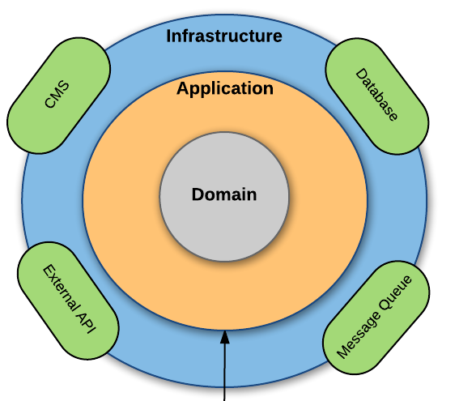

# InstaStore API

Welcome to InstaStore API.

## Usage

### Build and run service

#### Command Line

1. Ensure your environtment have
    - Node.js (>= 18.x)
    - npm (>= 10.x)

2. Set env variables: copy from .env.expample

3. Install npm dependencies

    ```bash
    npm i
    ```

4. Start the server dev mode:

    ```bash
    npm start
    ```

5. The API will be available at `http://localhost:3000`

#### Container

1. Ensure docker daemon is running in you machine

2. Build the Docker image:
    
    ```bash
    docker build -t instastore .
    ```

2. Run the Docker container:
    
    ```bash
    docker run -p 3000:3000 instastore
    ```

4. The API will be available at `http://localhost:3000`

### Endpoints

- `GET /api/v1/store/closest` - Retrieves the closest store.

  ```bash
  curl -X GET "http://localhost:3000/api/v1/store/closest?lon=10&lat=10"
  ```

### Scripts

- Run and build code: use the scripts commands

  ```bash
  npm run build
  npm run serve
  ```

- Run test: use the scripts commands

  ```bash
  npm run test
  ```


## Logger

- The logger is supported with Winston library

- The logger is stored in logs folder 


## Architecture

Domain-Driven Design (DDD) is an approach to software development that emphasizes structuring the software around the core business domain. The goal of DDD is to ensure that the design of the system closely reflects the real-world business processes and rules, making the software more maintainable, scalable, and aligned with business needs.

- Domain: The core business logic and rules that the software is designed to address.
- Entities: Objects that have a distinct identity and lifecycle, such as User or Order.
- Repositories: Abstractions that handle data retrieval and persistence, keeping the domain model isolated from infrastructure concerns.
- Services: Stateless operations that encapsulate domain logic not naturally suited for an entity or value object.

By aligning the system architecture with the domain, DDD helps teams focus on delivering business value while maintaining clear boundaries and minimizing complexity.

### Folders

- Application: Contains use cases and coordinates the flow of data between the domain and external layers. It manages tasks but doesn’t hold business logic.

- Domain: The core of the business logic, containing entities, value objects, and domain services. This layer is independent of external systems.

- Infrastructure: Handles external concerns like databases and APIs, providing concrete implementations of repositories and other services.

### DDD Architecture Diagram

